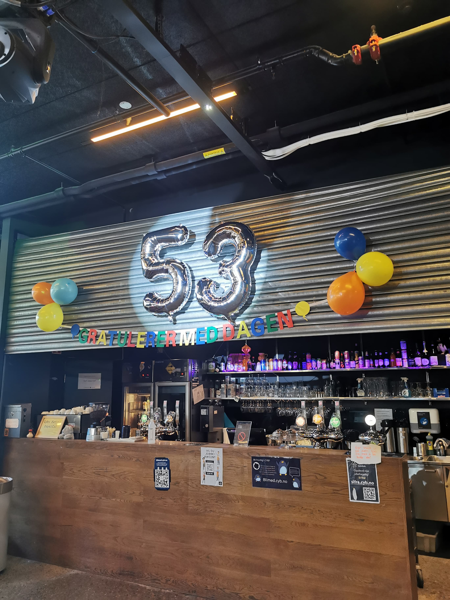

# CYB bursdag



Vår kjære kjellerforening Cybernetisk Selskab har bursdag om ikke så lenge, og du vil overraske dem med et bursdagskort. Dessverre har du glemt både hvor gamle de blir, og å søke penger fra Fordelingsutvalget! Heldigvis har du uendelig mange bursdagskort liggende hjemme, ett for hvert av primtallene.

Du husker ikke helt hvor mange år de fyller, men du er sikker på at det er et tall mellom `m` og `n`. Hva er da sannsynligheten for at du unngår å kjøpe et kort, og dermed slipper å sende en sånn fæl ettersøknad til FU?

### Input
To heltall, `m` og `n`.

### Output
Sannsynligheten i prosent for at du har et passende kort liggende.

### Sample input
```
35 60
```

### Sample output
```
24.0
```