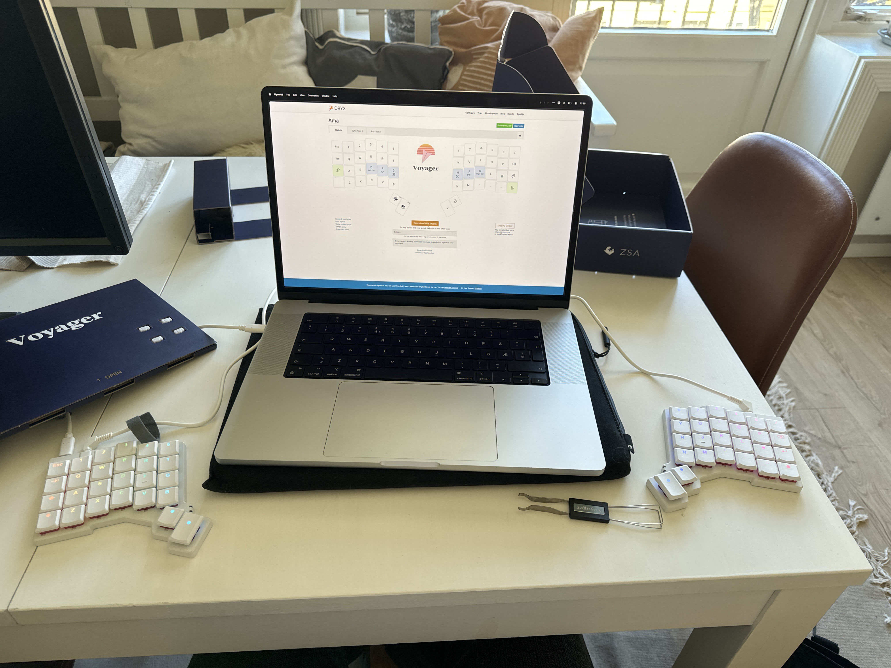

# Catwalken



Du har nettopp kjøpt deg nytt mekanisk tastatur, og tenker å møte opp på IFI for å briefe litt. Etter å ha blitt kastet ut av samtlige linjerom, biblioteket, Black Box, samt hvilerommet, vender du snuten mot catwalken i tredje - alle må få med seg dit nye keyboard!

Dessverre for deg prøver folk å sitte i fred da det snart er eksamen, og de har dermed spredt seg godt over ulike bord. I tillegg er det begrenset kapasitet på bordene, så du kan ikke nødvendigvis bare smette inn på det mest befolkede bordet. Gitt at alle på bordet ditt og de `n` nærmeste bordene blir irritert, hva er det største antallet personer du klarer å irritere, gitt at du setter deg på et ideelt bord?

### Input
Input består av to heltall `b` og `n` etter hverandre: antall bord og antall nabo-bord som hører tastene dine. Deretter følger `b` linjer, som også alle består av to heltall `c` og `k`, antall personer som sitter på et og bordets kapasitet. Bordenes rekkefølge gir plasseringen deres (det første bordet er nærmest Domus Athletica, det siste bordet er nærmest Blindern Studenterhjem).

### Output
Det største antallet personer som hører tastene dine, dersom du setter deg på et ideelt bord.

### Input sample
```
8
2
3 3
5 6
6 7
3 3
2 4
5 6
6 6
4 5
```

### Output sample
```
22
```
