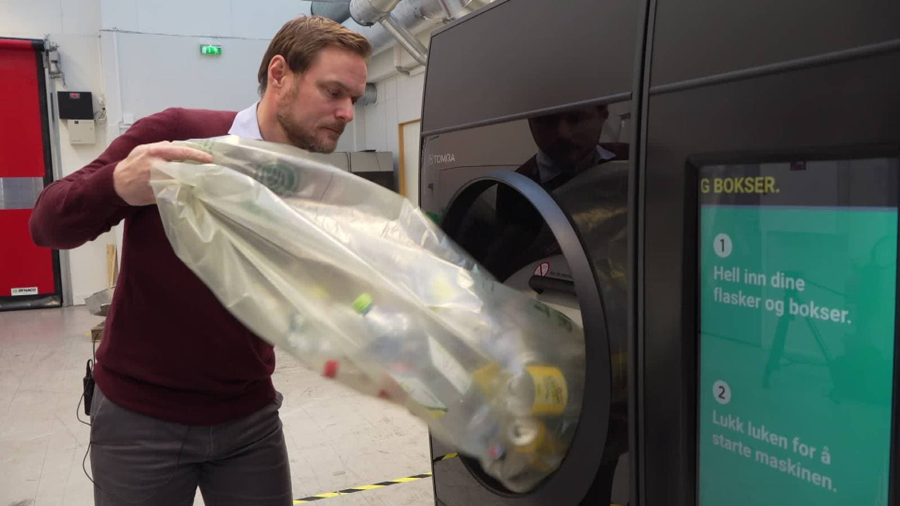

## Oppgave: Pantemannens Loot-runde på IFI-bygget

Pantemannen har bestemt seg for å utføre en loot-runde på Institutt for informatikk (IFI) for å samle inn så mange pantegjenstander som mulig. IFI-bygget består av flere rom koblet sammen av dører. Noen dører er åpne og tillater fri bevegelse mellom rommene, mens andre dører er låste og krever en nøkkel for å åpnes.

Gitt følgende informasjon om IFI-byggets layout:
- Rommene er representert som noder i en graf, hvor hver node representerer et rom
- Avstanden mellom rommene er representert som kantene i grafen, med vektede kanter som angir total loot score (pant) mellom de to rommene.

- Noen dører krever en nøkkel for å åpnes, og Pantemannen har kun en begrenset mengde nøkler tilgjengelig.
- Pantemannen starter loot-runden på Fortran og er ferdig når han ikke når lengre. 

Kan du implementere en algoritme som hjelper Pantemannen med å maksimere antall rom besøkt og loot score samlet under loot-runden på IFI-bygget, gitt grafen som representerer byggets layout og en liste over tilgjengelige nøkler?

Funksjonen returnerer antall rom besøkt og total pant samlet

