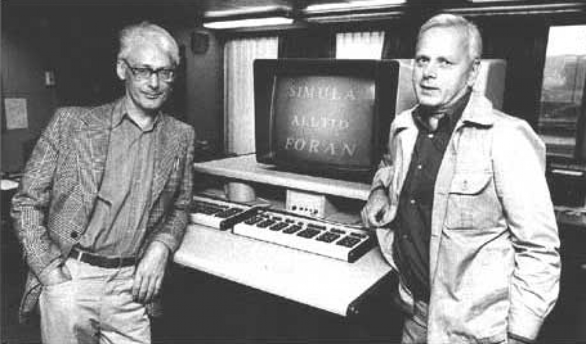

# Visste du at...



Det er en frodig tirsdag i april, og du er på vei hjem etter en IN1010-forelesning. En av de nye 17-trikkene ankommer Forskningsparken, du stiger på og setter deg ned for å sjekke Linkedin på mobilen. Idet du tildeldigvis løfter blikket fra skjermen, får du øye på en gammel kjenning som smiler til deg fra andre siden av trikken. Er det ikke Stein Gjessing?

Stein la nemlig merke til at det stakk en kopi av Big Java ut av totebagen din, og tusler bort for å starte en samtale: "Oja, Big Java. Java, ja, det er et objektorientert programmeringsspraag. Visste du at Kristen Nygaard og Ole-Johan Dahl fant opp spraaget Simula og objektorientert programmering, som naa er det dominerende paradigmet for programmering i verden...". Til slutt soner du ut, og når etter hvert også stoppet ditt. Du vinker høflig farvel, men blir plutselig litt nysjerrig. Hvor mange ganger nevnte han egentlig OOP?

### Input
Input er en tekst som starter med "Visste du at..." og slutter med et utropstegn.

### Output
Antall ganger "Ole-Johan Dahl", "Kristen Nygaard", "Simula" og "OOP" blir nevnt til sammen i løpet av samtalen med Stein.

### Sample input
```
Visste du at...
Kristen Nygaard og Ole-Johan Dahl fant opp programmeringsspraaket Simula
og at de regnes å være forfedrene til paradigmet OOP!
```

### Samle output
```
4
```
